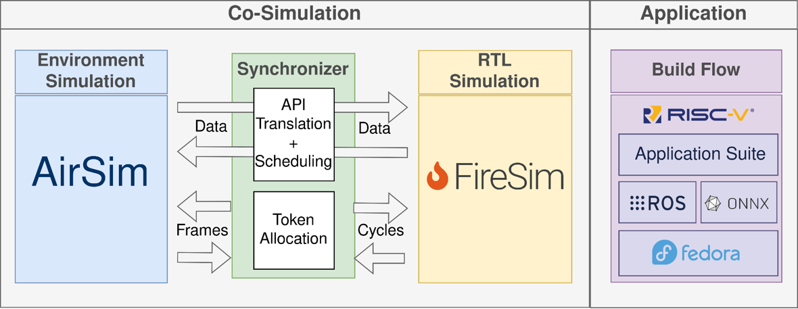

RoSÉ Design
========================

Top Level Architecture
------------------------

   Fig. 1: Top level block diagram of RoSÉ, depicting co-simulation and software infrastructure components.

RoSÉ consists of two main components: The co-simulation infrastucture, and the appplication build flow. As shown in Figure 1, the co-simulation infrastructure consists of three main components. First, a robotics simulator is necessary to model the robot's behavior in an environment. Currently, RoSÉ builds upon `AirSim <https://airsim-fork.readthedocs.io/en/docs/>`_, a UAV simulator, and `FireSim <https://fires.im>`, an FPGA-accelerated RTL simulator. AirSim models the sensing, actuation, and dynamics of the UAV, while FireSim runs cycle-exact simulations of a robotics SoC. RoSÉ synchronizes these simulators by translating robotics simulator APIs to IO packets seen by the SoC, and by performing lockstep synchronization between the two simulators.

Additionally, RoSÉ provides an application build flow using `FireMarshal <https://docs.fires.im/en/stable/Advanced-Usage/Workloads/FireMarshal.html>`_, which can be used to generate Linux images containing classical robotics workloads (using `ROS <https://www.ros.org/>`_) and DNN based workloads (using `ONNX-runtime <https://github.com/ucb-bar/onnxruntime-riscv/tree/onnx-rose>`_). 
